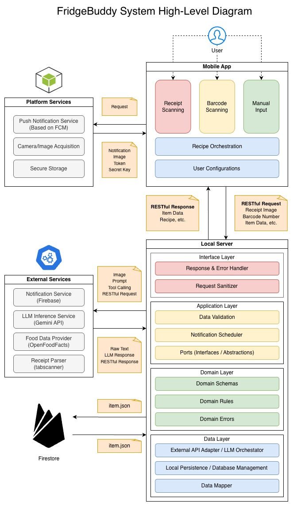
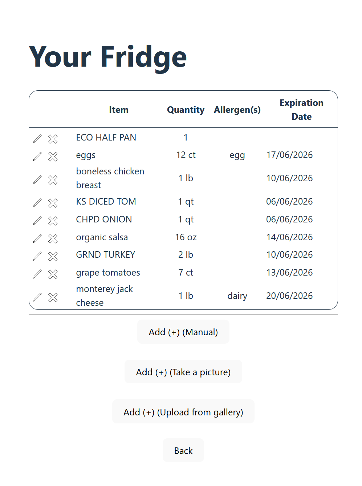
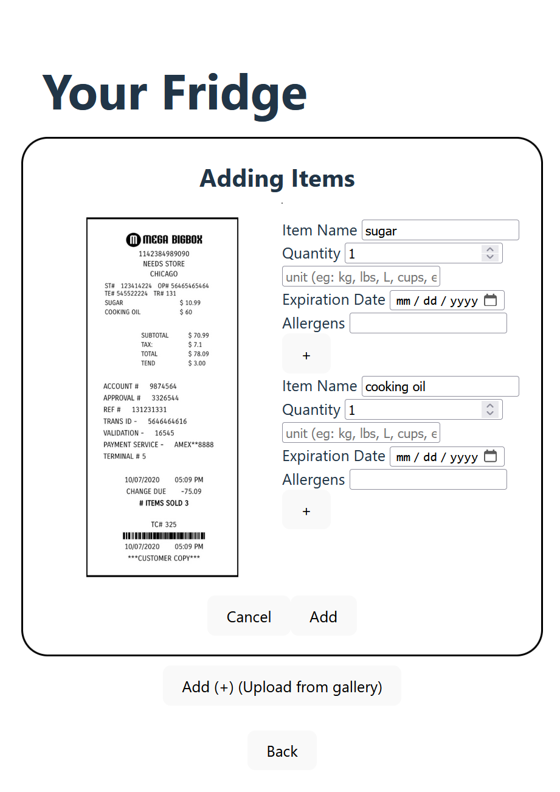
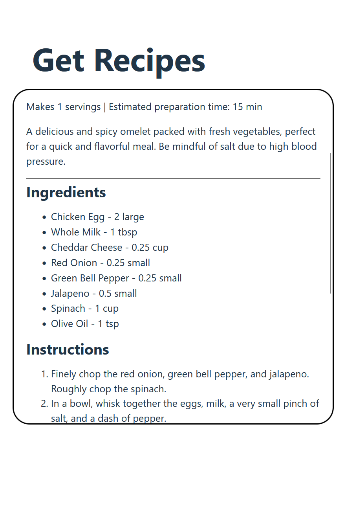

# FridgeBuddy

## Overview

FridgeBuddy is a personal digital fridge application for tracking what food a user already has at home. The project is motivated by common fridge-management problems: forgotten items expiring in the back of the fridge, duplicate grocery purchases, and the extra cost and waste caused by spoiled food.

Unlike smart-fridge products that require specialized appliances, cameras, or appliance-specific integrations, FridgeBuddy is designed to work with an ordinary refrigerator. The app focuses on a mobile-friendly inventory experience, receipt and barcode-assisted item entry, and AI-powered recipe suggestions based on the user's current fridge contents and dietary preferences.

## Team

- Ruth Sun - Team Lead, Frontend Developer
- Susan Noori - Backend Developer
- Sheng-Cheng Lee - Backend Developer

Repository: <https://github.com/susan2099/FridgeBuddy.git>

## Features

- Cloud-backed fridge inventory management for tracking items, quantities, and expiration dates in Firestore.
- Manual item entry for adding food directly to the digital fridge.
- Barcode scanning for quickly identifying packaged grocery items through Open Food Facts.
- Receipt scanning for adding multiple purchased items from a receipt image, with Gemini-powered item-name normalization.
- Expiration push notifications for food nearing its expiry date, supported in browser and Android runs whether the app is in the foreground or background.
- Preference management for dietary restrictions and culinary preferences.
- AI recipe generation that uses fridge ingredients, restrictions, preferences, and a free-form user prompt.
- Mobile-friendly navigation between the home screen, fridge inventory, recipe generator, and preferences.

## Architecture

FridgeBuddy follows a mobile-app-to-backend architecture. The app collects manual entries, barcode scans, receipt images, recipe requests, and user preferences, then sends them to the local server through RESTful requests.

The backend coordinates validation, notification scheduling, Firestore persistence, and calls to external services such as Gemini, Open Food Facts, Tabscanner, and Firebase Cloud Messaging. Firestore serves as the cloud source of truth for fridge inventory data.

See the high-level architecture diagram below for the full component layout and request/response flow.



## Tech Stack

**Frontend & Mobile**

- **React**: frontend UI framework.
- **TypeScript**: typed frontend development.
- **Vite**: development server and frontend build tooling.
- **Capacitor**: mobile packaging for Android.
- **Android Studio**: Android emulator and device testing.

**Backend**

- **Node.js**: JavaScript runtime for the backend.
- **Express**: RESTful API server.

**Cloud & Platform Services**

- **Firebase Admin / Firestore**: cloud-backed fridge inventory persistence.
- **Firebase Cloud Messaging**: browser and Android expiration push notifications.

**External APIs**

- **Gemini API**: recipe generation and receipt item-name normalization.
- **Tabscanner API**: receipt OCR and item extraction.
- **Open Food Facts**: barcode-based food data lookup.

**Project Management**

- **Jira**: issue and workflow tracking.

## Setup

### Initial Setup

Prerequisites:

- Node.js and npm available in your shell.
- Android Studio, if you want to run the mobile app in an Android emulator.
- A Firebase service account JSON file for backend fridge persistence.
- Firebase Cloud Messaging configuration for browser and Android push notifications.
- API keys for Gemini and Tabscanner if you want to use recipe generation or receipt scanning.

Clone the repository and install dependencies locally inside the project directories:

```bash
git clone https://github.com/susan2099/FridgeBuddy.git
cd FridgeBuddy

cd server
npm install

cd ../client/FridgeBuddy
npm install
```

Create `server/.env` with project-local settings:

```env
PORT=3000
GEMINI_API_KEY=your_gemini_key_here
TABSCANNER_API_KEY=your_tabscanner_key_here
```

Place the Firebase service account file at:

```text
server/config/serviceAccountKey.json
```

Reference: [Firebase Admin SDK setup documentation](https://firebase.google.com/docs/admin/setup#initialize_the_sdk_in_non-google_environments)

Do not commit `.env` or `server/config/serviceAccountKey.json`. The service account file is a project-local secret and is already covered by the repository ignore rules.

### Firebase Cloud Messaging setup

FridgeBuddy uses Firebase Cloud Messaging (FCM) for expiration alerts. After cloning the repository, connect the app to your own Firebase project before running browser or Android push notifications.

These setup steps follow the official Firebase docs for [Web FCM setup](https://firebase.google.com/docs/cloud-messaging/web/get-started), [Android FCM setup](https://firebase.google.com/docs/cloud-messaging/android/get-started), [adding Firebase to Android](https://firebase.google.com/docs/android/setup), and [Firebase Admin SDK setup](https://firebase.google.com/docs/admin/setup#initialize_the_sdk_in_non-google_environments).

In Firebase Console, create or choose a Firebase project, enable Cloud Messaging, and create a Web app. Copy the Web app config into `client/FridgeBuddy/.env`. Also generate a Web Push certificate from Project settings > Cloud Messaging > Web Push certificates, then use its public key as `VITE_FIREBASE_VAPID_KEY`.

```env
VITE_FIREBASE_API_KEY=your_web_api_key
VITE_FIREBASE_AUTH_DOMAIN=your_project.firebaseapp.com
VITE_FIREBASE_PROJECT_ID=your_project_id
VITE_FIREBASE_STORAGE_BUCKET=your_project.firebasestorage.app
VITE_FIREBASE_MESSAGING_SENDER_ID=your_sender_id
VITE_FIREBASE_APP_ID=your_web_app_id
VITE_FIREBASE_VAPID_KEY=your_public_web_push_vapid_key
```

Update `client/FridgeBuddy/public/firebase-messaging-sw.js` with the same Firebase Web app config. This service worker is required for browser background notifications.

For Android push notifications, add an Android app in the same Firebase project with this package name:

```text
com.fridgebuddy.fridgebuddy
```

Download `google-services.json` from Firebase Console and place it here:

```text
client/FridgeBuddy/android/app/google-services.json
```

The backend also needs a Firebase service account file so it can save tokens and send FCM messages:

```text
server/config/serviceAccountKey.json
```

After these files are in place, rebuild and sync Capacitor before running Android:

```bash
cd client/FridgeBuddy
npm run build
npx cap sync android
npx cap run android
```

For browser testing, start the backend and the Vite dev server, then accept the browser notification permission prompt. For Android testing, use a device or emulator with Google Play services; Android 13 and later will also show a runtime notification permission prompt.

Start the backend API:

```bash
cd server
npm start
```

In a second terminal, build or run the client:

```bash
cd client/FridgeBuddy
npm run build
```

### Running the mobile app (on Android Studio emulator)

After completing the initial setup, build the web assets and sync Capacitor:

```bash
cd client/FridgeBuddy
npm run build
npx cap sync android
npx cap open android
```

Run the app from Android Studio using an emulator or connected Android device.

If Android Studio fails to build or launch the app, try preparing the Android
dependencies from the terminal first, then run directly through Capacitor:

```bash
cd client/FridgeBuddy
npm install
npm run build
npx cap sync android
npx cap run android
```

Capacitor will prompt you to choose an available emulator or connected Android
device. This can be useful when Android Studio has trouble resolving Gradle or
project dependencies on its own.

### Running in-browser

Start the backend:

```bash
cd server
npm start
```

Start the Vite development server in another terminal:

```bash
cd client/FridgeBuddy
npm run dev
```

Open the localhost URL printed by Vite in your browser. Keep the backend running on `PORT=3000` so the frontend request URL matches the API server.

## Screenshots

**Inventory Management**

View fridge items with their quantities and expiration dates, and keep the digital fridge inventory up to date.



**Scanner**

Add food by scanning barcodes or receipts, reducing the amount of manual entry needed after grocery trips.



**Recipe Generation**

Generate recipe ideas from fridge contents, dietary restrictions, culinary preferences, and user-provided prompts.



## Demo Video

Demo video: `fridgebuddy.mp4`

## Future Work

**Inventory Intelligence**

- **Smart expiry predictions**: use machine learning to predict spoilage based on usage patterns.
- **Shopping assistant**: generate smart shopping lists based on inventory history and user preferences.

**Collaboration**

- **Multi-user support**: allow households to share and manage inventories.
